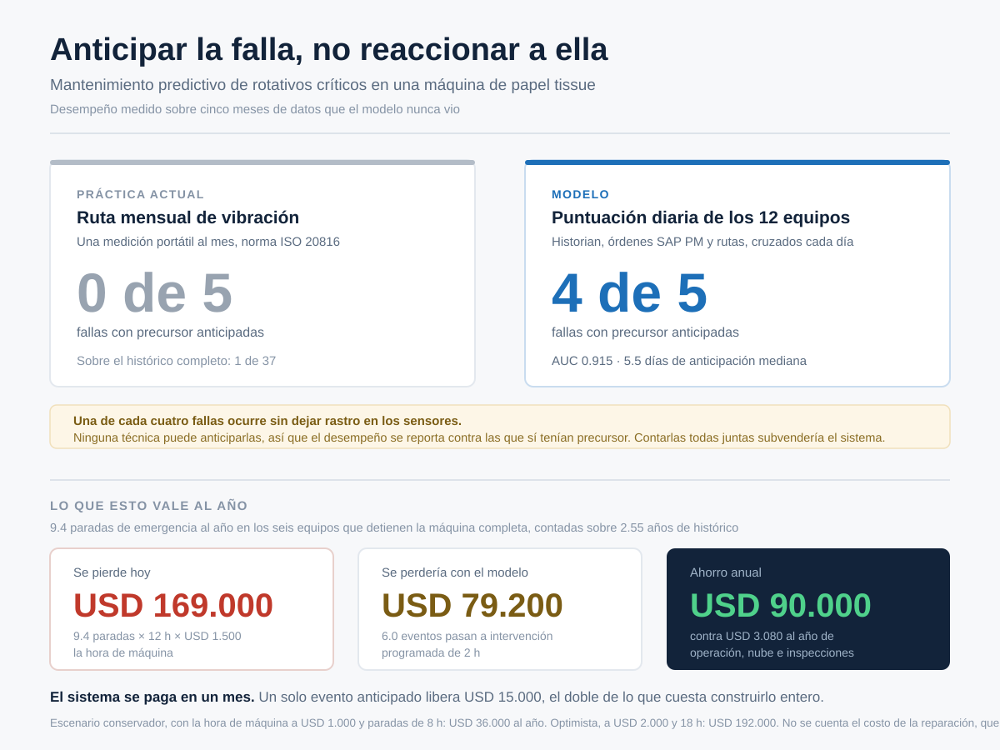

# tissue-mill-mlops

**Mantenimiento predictivo para una máquina de papel tissue, del dato crudo al modelo desplegado.**

[](https://github.com/XxHurtadoxX/tissue-mill-mlops/actions/workflows/ci.yml)
[](https://github.com/XxHurtadoxX/tissue-mill-mlops/actions/workflows/daily-data.yml)

Proyecto de portafolio de **[Daniel Hurtado](https://github.com/XxHurtadoxX)**, economista. Cubre el caso completo, desde generar unos datos de planta que se comporten como datos de planta hasta el sistema que entrena, evalúa y despliega el modelo solo sobre Azure Machine Learning, pasando por el encuadre económico que decide cuándo vale la pena alertar.

## El problema

En una máquina de papel tissue la producción es una línea continua. Si un equipo se detiene, se detiene toda la máquina, y una bomba de vacío que falla un domingo a las dos de la mañana cuesta unas 18 horas de parada y más de 40 toneladas perdidas.

Las señales suelen estar ahí antes del evento. La corriente del motor llevaba dos semanas subiendo y la ruta de vibración del mes ya marcaba la bomba en zona C. Nadie las cruza porque viven en sistemas distintos y cada turno atiende lo suyo.

Un dato resume el tamaño del hueco: sobre 37 fallas en dos años y medio, **la ruta mensual de vibración que se usa hoy anticipa una**. No es que la norma esté mal. Es que una medición al mes no alcanza a atrapar una degradación que se desarrolla en cuatro semanas.

## Resultado



Medido sobre cinco meses que el modelo nunca vio y que no intervinieron en ninguna decisión de diseño:

| | Modelo | Práctica actual |
|---|---|---|
| AUC | 0.915 | — |
| Fallas con precursor anticipadas | **4 de 5** | 0 de 5 |
| Anticipación mediana | 5.5 días | — |
| Inspecciones generadas al mes | 8 | 1 ruta mensual |

Una de cada cuatro fallas ocurre sin dejar rastro en los sensores, por un golpe o una fractura súbita, y ninguna técnica puede anticiparlas. Por eso el desempeño se reporta contra las que sí tenían precursor. Contarlas todas juntas subvendería el sistema y ocultaría dónde están sus límites reales.

El umbral que separa alertar de no alertar no se eligió maximizando una métrica. Se eligió a partir de cuántas inspecciones puede atender el turno de mantenimiento en un mes, que es una restricción del cliente y no del modelo.

## Cuánto vale

Los seis equipos cuya parada detiene la máquina completa acumulan **9.4 fallas al año**, contadas sobre el histórico. La ruta mensual de vibración anticipa una de cada 37, así que en la práctica todas llegan como parada de emergencia.

| | Al año |
|---|---|
| Se pierde hoy | USD 169.000 |
| Se perdería con el modelo | USD 79.200 |
| **Ahorro** | **USD 90.000** |
| Costo de operar el sistema | USD 3.080 |

Con la hora de máquina a USD 1.500 y paradas no programadas de 12 horas. En el escenario conservador, a USD 1.000 y 8 horas, el ahorro baja a USD 36.000 y el sistema todavía se paga en el primer trimestre.

Esa holgura no viene de que el modelo sea bueno, viene de la asimetría del problema. Una hora de técnico cuesta cincuenta veces menos que una hora de máquina parada, de modo que alertar de más sale barato y alertar de menos sale caro. El cálculo completo, con lo que deja fuera y por qué, está en [docs/caso-negocio.md](docs/caso-negocio.md).

## Cómo funciona

```
historian, SAP PM, rutas de vibración
        │
        ├─ limpieza          descarta lecturas BAD y sensores congelados
        ├─ tabla diaria      una fila por equipo y día, con ventanas móviles
        ├─ etiquetas         ¿falla en los próximos 14 días?
        │
        ├─ modelo            ExtraTrees sobre 11 variables
        ├─ umbral            fijado por la capacidad de inspección
        │
        └─ endpoint por lotes    puntúa los doce equipos cada mañana
```

Todo lo de Azure Machine Learning está declarado en YAML bajo [`aml/`](aml/), incluidos el pipeline de reentrenamiento y la compuerta que decide si el modelo nuevo merece reemplazar al actual. El endpoint es por lotes y no en línea, y esa decisión tiene su propio documento porque cambia el costo por un factor de 288: [docs/decision-tipo-de-endpoint.md](docs/decision-tipo-de-endpoint.md).

## El simulador de datos

Antes del modelo había que resolver otra cosa: conseguir datos de planta que se comporten como datos de planta, con su suciedad incluida. No encontré un generador abierto en español que simulara historian, órdenes de mantenimiento y rutas de vibración con ese detalle, así que lo escribí para este proyecto.

| Fuente | Qué simula | Suciedad incluida |
|---|---|---|
| **Historian** (DCS) | Lecturas por hora con tags ISA-5.1 (`TIS1.45VI4523.PV`) | Lecturas `-9999` y `BAD` por fallo de comunicación, sensores congelados, huecos por parada |
| **Lotes de pulper** | Duración, kg y kWh de cada lote | Firma del desgaste del rotor, con kWh/kg subiendo ciclo a ciclo |
| **Rutas de vibración** | Medición mensual portátil, RMS y gE con zona ISO 20816 | — |
| **Órdenes SAP PM** | Avisos y órdenes de trabajo | Texto libre con errores y sin tildes, fecha de aviso distinta de la fecha real de falla |
| **Ground truth** | El oráculo: onset y fecha real de cada falla | Separado a propósito. No construye variables, solo evalúa |

La generación es determinista. Con la misma semilla se reproduce exactamente la misma historia de planta. El tiempo entre fallas sigue una Weibull, apropiada para desgaste mecánico, en vez de la exponencial que asume fallas puramente aleatorias.

También está calibrado para que el problema conserve su dificultad. Una de cada cuatro fallas es silenciosa, el punto de operación de cada equipo deriva de un día a otro por causas legítimas, y algunos instrumentos se descalibran e imitan una degradación que no existe. Con eso, la mejor variable individual llega a AUC de 0.85, un rango creíble. El detalle está en el [diccionario de datos](docs/diccionario-datos.md).

## Datos que llegan a diario

Una planta real genera datos todos los días, así que el repositorio también. El workflow [`daily-data.yml`](.github/workflows/daily-data.yml) corre a las 06:00 UTC, genera el extracto de esa fecha y comprueba que se reproduzca idéntico al volver a generarlo, que es lo que garantiza que el histórico siga siendo reconstruible.

Durante el primer mes además commiteaba cada extracto, y el historial conserva más de sesenta de esos commits. Dejó de hacerlo al proteger la rama principal. Un automatismo que escribe en `main` sin pasar las verificaciones es justamente lo que esa protección impide, y las alternativas pasaban por guardar credenciales de larga duración. Ahora publica el extracto como artefacto de cada ejecución.

## Uso

```bash
git clone https://github.com/XxHurtadoxX/tissue-mill-mlops.git
cd tissue-mill-mlops
pip install -r requirements-dev.txt
```

El repositorio trae una muestra de 120 días en `data/`, así que se puede explorar sin generar nada. Para reconstruir el histórico completo y armar la tabla de entrenamiento:

```bash
python -m src.simulator.generate --from 2024-01-01 --to 2026-07-26 --out workdir
python -m src.features.build_dataset --data workdir --out workdir/gold
```

Son unos 45 MB que quedan en `workdir/`, fuera del control de versiones porque estos dos comandos los regeneran.

Para comprobar el código, lo mismo que corre la integración continua:

```bash
flake8 src tests
pytest
```

## Estructura

```
src/simulator/     genera los datos, solo con librería estándar
src/features/      limpieza, ventanas móviles, etiquetas y partición temporal
src/model/         variables, evaluación, umbral, entrenamiento y compuerta
aml/               Azure ML declarado en YAML: cómputo, datos, pipeline, endpoint
tests/pipeline/    guardas contra fuga de información y validez de los YAML
tests/simulator/   determinismo y firmas físicas del generador
docs/              caso de negocio, diccionario de datos y decisiones de diseño
data/              muestra viva versionada
```

El simulador no usa librerías externas, de modo que el workflow diario corre sin instalar nada. Pandas y numpy solo hacen falta para construir la tabla.

Las pruebas del pipeline vigilan un tipo de error concreto. **Una fuga de información no produce ningún fallo visible**: el código corre, las métricas mejoran y el problema aparece meses después en producción. Contra eso no sirve revisar el código con cuidado, porque el error reaparece en la siguiente modificación.

## Lo que no está resuelto

Dos cosas quedan abiertas y se anotan aquí en vez de darlas por hechas.

La compuerta del reentrenamiento decide si el modelo nuevo merece reemplazar al actual, y lo hace bien: en su última corrida rechazó al candidato porque anticipaba cuatro de cinco eventos frente a cinco de cinco del modelo en servicio. Pero ningún paso actúa sobre esa decisión. Escribe el veredicto y ahí se queda.

Y convivir con dos despliegues bajo el mismo endpoint no llegó a funcionar. El plano de control daba el despliegue nuevo por creado, el endpoint nunca lo reconoció, y Azure no expuso el motivo por ninguna vía. Está documentado en [docs/decision-tipo-de-endpoint.md](docs/decision-tipo-de-endpoint.md) junto con lo que sí funciona, que es el cambio de versión y la vuelta atrás.

## Datos

Son **100% sintéticos**, generados por el simulador. No provienen de ninguna planta real ni contienen información confidencial. El caso está inspirado en la operación típica de una máquina tissue de fibra reciclada.

## Autor

**Daniel Hurtado** ([@XxHurtadoxX](https://github.com/XxHurtadoxX)), economista. El proyecto nace de una pregunta que se responde mejor con datos que con intuición: cuánto cuesta de verdad esperar a que un equipo falle, y a partir de qué punto conviene molestar a un técnico para que vaya a mirarlo.

Si te sirve para tu propia planta o quieres discutir el enfoque, los issues están abiertos.

Distribuido bajo licencia [MIT](LICENSE).
